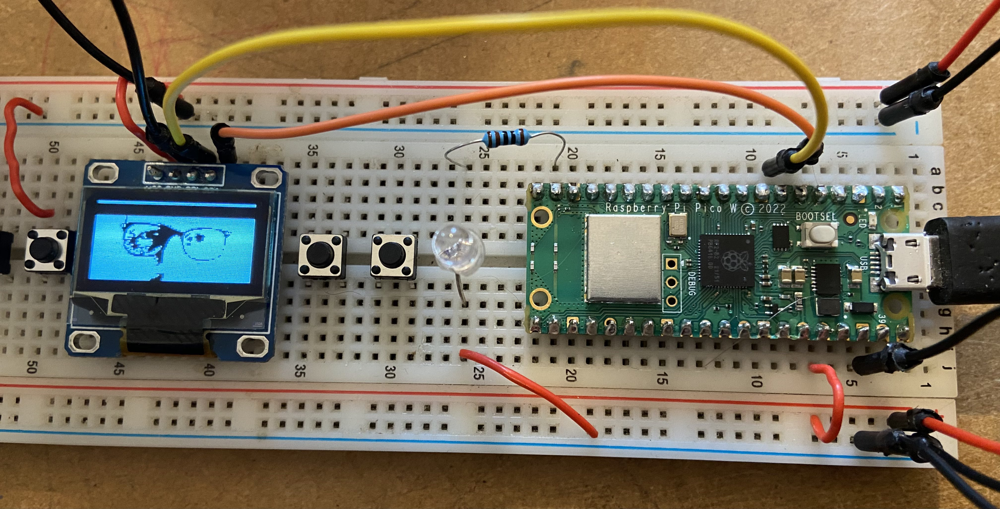

# RPI PICO ssd1306 oled lib (with examples)

## Purpose Overview 

this is hopefully a better graphics library for the common oled's ported from rpi and adafruit to rpi pico. for games gameplay and UIs. using basically the same code underneath but some higher level abstractions for convenience.

Based on (Inspired/Copied) code from RPi Foundation Pico Examples
lso from Adafruit Arduino SSD1306 Driver Code combined into more complete rpi pico lib. 

## External documents and datasheets... 

https://datasheethub.com/ssd1306-128x64-mono-0-96-inch-i2c-oled-display/ 

https://datasheethub.com/wp-content/uploads/2022/08/SSD1306.pdf

https://cdn-shop.adafruit.com/datasheets/SSD1306.pdf  

## instructions

1. plug your oled into pins 6 and 7 on your rpi (pins are configurable)
2. compile the example using the cmake file provided
3. drag it over to the usb device

## roadmap

- [x] refactored example oled code provided by the rpi people
- [ ] basic font code from the adafruit library
- [ ] graphics primitives from the adafruit library
  - [ ] line
  - [ ] triangle
  - [ ] rect
  - [ ] poly, circle, etc

- [ ] 2d game graphics
  - [ ] sprites
  - [ ] animations

- [ ] 2d image masking & compositing like cairo graphics
  - [ ] multiple draw surfaces
  - [ ] write/copy from one surface to another 
  - [ ] other logical operation (AND OR XOR NOT etc) from one surface to another

- [ ] grid 9 images for frames etc

- [ ] raycasting engine
- [ ] proper 3d engine

